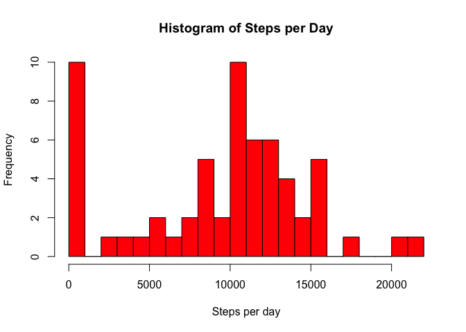
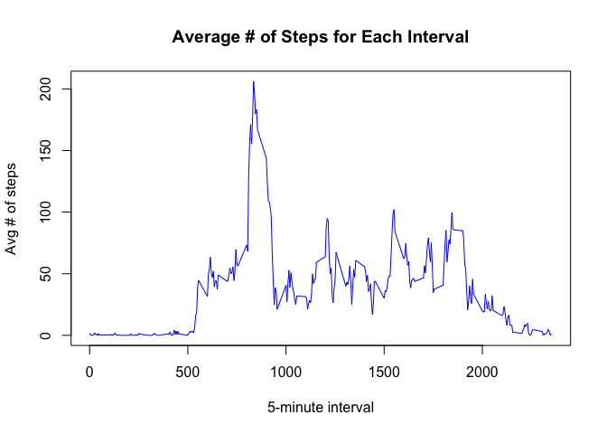
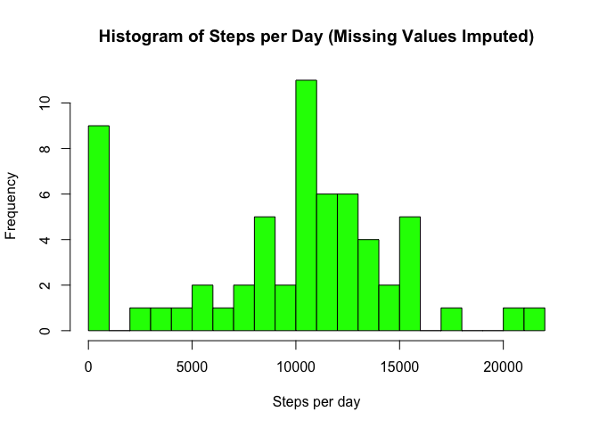
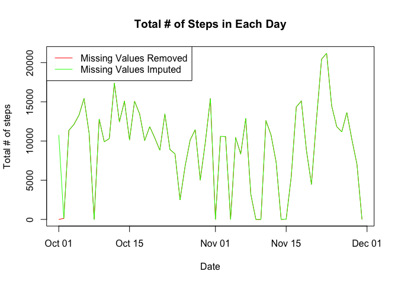
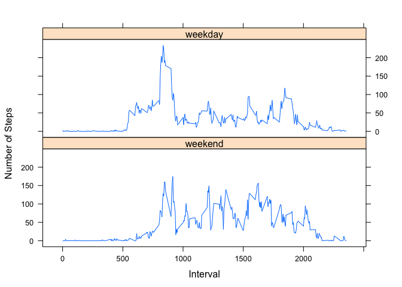

## Loading and preprocessing the data

In this section we load the data. No transformation is necessary because the data is
already in a format that is suitable for our analysis


```r
activity <- read.csv("activity.csv")
```

## What is mean total number of steps taken per day?

In this section we perform the following (ignoring the missing values):

1. Calculate the total number of steps taken per day
2. Make a histogram of the total number of steps taken each day
3. Calculate and report the mean and median of the total number of steps taken per day


```r
stepsPerDay <- aggregate(activity$steps, by=list(activity$date), 
                         FUN=sum, na.rm=TRUE)
hist(stepsPerDay$x, breaks = 20,
     main="Histogram of Steps per Day",
     xlab="Steps per day", ylab="Frequency", col="red")
```

<!-- -->

```r
meanSteps <- mean(stepsPerDay$x)
print(paste0("Mean of total steps per day: ", round(meanSteps,2)))
```

```
## [1] "Mean of total steps per day: 9354.23"
```

```r
medianSteps <- median(stepsPerDay$x)
print(paste0("Median of total steps per day: ", round(medianSteps,2)))
```

```
## [1] "Median of total steps per day: 10395"
```

## What is the average daily activity pattern?

In this section we will make a time series plot of the 5-minute interval (x-axis) and 
the average number of steps taken, averaged across all days (y-axis), and determine Which 
5-minute interval, on average across all the days in the dataset, contains the maximum number of steps?


```r
AvgstepsPerIinterval <- aggregate(activity$steps, by=list(activity$interval), 
                         FUN=mean, na.rm=TRUE)
with(AvgstepsPerIinterval, plot(Group.1, x, type="l", col="blue",
     main="Average # of Steps for Each Interval",
     xlab="5-minute interval", ylab="Avg # of steps"))
```

<!-- -->

```r
MaxStepsInterval <- AvgstepsPerIinterval$Group.1[which.max(AvgstepsPerIinterval$x)]
print(paste0("The 5-minute interval with max # of steps: ", round(MaxStepsInterval,2)))
```

```
## [1] "The 5-minute interval with max # of steps: 835"
```

## Imputing missing values

In this section we will perform the following tasks:

1. Calculate and report the total number of missing values in the dataset 
2. Devise a strategy for filling in all of the missing values in the dataset. Here we use the "mean" value of the 5-minute interval to fill the missing values. 
3. Create a new dataset that is equal to the original dataset but with the missing data filled in.
4. Make a histogram of the total number of steps taken each day and Calculate and report the mean and median total number of steps taken per day. 


```r
print(paste0("Total # of missing values: ", sum(is.na(activity$steps))))
```

```
## [1] "Total # of missing values: 2304"
```

```r
activity2 <- activity
# strategy for imputing missing data: replace missing values with "mean" value of the corresponding 5-minute interval 
activity2[is.na(activity2$steps),1] <- AvgstepsPerIinterval$x[AvgstepsPerIinterval$Group.1==activity2$interval[is.na(activity2$steps)]]
stepsPerDay2 <- aggregate(activity2$steps, by=list(activity2$date), 
                         FUN=sum, na.rm=TRUE)
hist(stepsPerDay2$x, breaks = 20,
     main="Histogram of Steps per Day (Missing Values Imputed)",
     xlab="Steps per day", ylab="Frequency", col="green")
```

<!-- -->

```r
meanSteps2 <- mean(stepsPerDay2$x)
print(paste0("Mean of total steps per day (Missing Values Imputed): ", round(meanSteps2,2)))
```

```
## [1] "Mean of total steps per day (Missing Values Imputed): 9530.72"
```

```r
medianSteps2 <- median(stepsPerDay2$x)
print(paste0("Median of total steps per day (Missing Values Imputed): ", round(medianSteps2,2)))
```

```
## [1] "Median of total steps per day (Missing Values Imputed): 10439"
```

Now let's answer these questions:

1. Do these values differ from the estimates from the first part of the assignment? 


```r
print(!((meanSteps2==meanSteps)|(medianSteps2==medianSteps)))
```

```
## [1] TRUE
```
2. What is the impact of imputing missing data on the estimates of the total daily number of steps?


```r
with(stepsPerDay, plot(as.Date(as.character(Group.1), format="%Y-%m-%d"), x, type="l", col="red",
     main="Total # of Steps in Each Day",
     xlab="Date", ylab="Total # of steps"))
with(stepsPerDay2, lines(as.Date(as.character(Group.1), format="%Y-%m-%d"), x, col="green",
     xlab=NA, ylab=NA))
legend("topleft", legend=(c("Missing Values Removed","Missing Values Imputed")), 
       col=c("red","green"), lty=c(1,1))
```

<!-- -->

## Are there differences in activity patterns between weekdays and weekends?

We use the dataset with the filled-in missing values for this part to do the following:

1. Create a new factor variable in the dataset with two levels – “weekday” and “weekend” indicating whether a given date is a weekday or weekend day.
2. Make a panel plot containing a time series plot (i.e. type="l") of the 5-minute interval (x-axis) and the average number of steps taken, averaged across all weekday days or weekend days (y-axis). 


```r
weekdays1 <- c('Monday', 'Tuesday', 'Wednesday', 'Thursday', 'Friday')
activity2$Weekend <- factor(weekdays(as.Date(as.character(activity$date), 
                                             format="%Y-%m-%d")) %in% weekdays1,
         levels=c(FALSE, TRUE), labels=c('weekend', 'weekday'))
AvgstepsPerIinterval2 <- aggregate(activity2$steps, by=list(activity2$Weekend,activity2$interval), 
                         FUN=mean, na.rm=TRUE)
library(lattice)
with(AvgstepsPerIinterval2, xyplot(x~Group.2|factor(Group.1),
       type='l',layout=c(1,2),
       xlab='Interval',ylab='Number of Steps'))
```

<!-- -->
